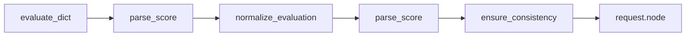

# System Audit v2 — AI Score Pipeline & Infrastructure

**Status:** Implemented: live HTTPS E2E (see §8), `CHATBOT_BASE_URL` / `CHATBOT_WIDGET_TIMEOUT_MS`, optional `RUN_LIVE_WIDGET_SMOKE` duman testi, Excel filtrede **`nodeid` birincil** kontrol (§5b).

## 1. Purpose & scope

- Define the **single authoritative pipeline** from raw LLM `evaluate()` output to `request.node.ai_score` / Excel / assertions.
- Align documentation with **Google Gen AI SDK** usage and **Excel reporting** behavior already centralized in [`utils/excel_writer.py`](../utils/excel_writer.py) and [`tests/conftest.py`](../tests/conftest.py).
- **E2E target:** Chatbot tests run against the **production widget** over HTTPS (see [§8 Live URL](#8-live-url-e2e-chatbot)), not a local `file://` HTML fixture.

## 2. `ai_score` pipeline (logical flow)

Order of operations (must not be reordered without updating tests):

1. **`evaluate(...)`** — `OpenAIProvider` or `GeminiProvider` returns a `dict` with `score`, `reasoning`, `status` (or system codes `SISTEM_KOTA` / `SISTEM_YETKI` on API errors).
2. **`_parse_llm_score(value) -> int`** — Coerces `score` to an integer in **0–5**; non-numeric / missing → **0**. Not a “business override”: parsing only. Implemented in [`utils/evaluation_utils.py`](../utils/evaluation_utils.py) as a private helper used by `prepare_ai_evaluation`.
3. **`normalize_evaluation(evaluation, bot_response)`** — **Only** business rule that may **lower** an LLM score: if `bot_response` contains evasion markers and parsed `score >= 3`, force `score = 2`, `status = FAIL`, and extend `reasoning`. Does **not** modify `SISTEM_*` outcomes in practice (those use `score` 0).
4. **Re-parse `score`** — After normalization, coerce again so types stay `int`.
5. **`_ensure_status_score_consistency(out)`** —  
   - Allowed `status` values: `PASS`, `FAIL`, `SISTEM_KOTA`, `SISTEM_YETKI`.  
   - Unknown / missing `status` → `FAIL`, `score` → `0`, reasoning annotated.  
   - `PASS` with `score < 3` → `FAIL` (inconsistent rubric vs. pass).  
   - `SISTEM_*` → leave status; coerce `score` to int (typically 0).
6. **Consumer** — [`tests/test_chatbot.py`](../tests/test_chatbot.py) sets `request.node.ai_score` / `ai_reasoning` / `ai_status` from the **final** dict. **`ai_score` is always an `int`.**  
7. **Assert** — `assert evaluation.get("status") == "PASS"` (no numeric threshold in assert; consistency is enforced in step 5).



## 3. Error handling & defaults

- **`prepare_ai_evaluation`** wraps steps 2–5 in `try/except`. On **any** exception → `{ "score": 0, "status": "FAIL", "reasoning": "[Değerlendirme hatası] ..." }`.
- **`test_chatbot`**: if `evaluate()` raises (unexpected), catch and use `{ "score": 0, "status": "FAIL", "reasoning": "[Hakem çağrısı hatası] ..." }` before attachments.

## 4. Google GenAI SDK (not `judge_factory` internals)

- Package: **`google-genai>=1.0`** in [`requirements.txt`](../requirements.txt).
- Client and calls live in [`utils/gemini_provider.py`](../utils/gemini_provider.py): `from google import genai`, `genai.Client(api_key=...)`, `client.models.generate_content(model=..., contents=...)`.
- [`utils/judge_factory.py`](../utils/judge_factory.py) only selects `OpenAIProvider` / `GeminiProvider`; it does **not** import the SDK directly.

## 5. Excel report safety

- **Collection:** [`tests/conftest.py`](../tests/conftest.py) — `pytest_runtest_makereport` appends to module-level `results_table` for each test **call**; parametrized cases produce one row per invocation.
- **Teardown:** Session-scoped `export_to_excel` uses **`yield`**; after session, `list(results_table)` snapshot → `write_excel_report`.
- **Directory:** [`utils/excel_writer.py`](../utils/excel_writer.py) — `Path.mkdir(parents=True, exist_ok=True)` on `reports/`.
- **Dependencies:** Missing `pandas` / `openpyxl` → clear message / log, no teardown crash.
- **Locked file:** `PermissionError` on primary `Chatbot_Test_Raporu.xlsx` → write `Chatbot_Test_Raporu_<timestamp>.xlsx`; double lock → user-visible warning, no uncaught exception.

## 5b. Report filtering (Excel & Allure)

**Goal:** Üretim raporları yalnızca gerçek chatbot E2E senaryolarını yansıtsın; altyapı / birim testleri toplu raporu kirletmesin.

### Excel (`results_table`)

- `pytest_runtest_makereport` içinde satır **`results_table.append(...)`** yalnızca resmi chatbot E2E modülünden gelen testler için çalışır.
- **Sözleşme (filtre):** `test_chatbot.py` dizesi testin **`nodeid`** içinde bulunmalıdır (ör. `tests/test_chatbot.py::test_monster_chatbot_per_question[...]`). Bu, `test_infra.py`, `test_logic_audit.py`, `test_reporting_logic.py` gibi modüllerin Excel özetine **hiç satır eklememesini** garanti eder.
- **Uygulama:** [`tests/conftest.py`](../tests/conftest.py) önce `nodeid` içinde `test_chatbot.py` arar; yoksa `item.path.name == "test_chatbot.py"` ile yedekler (normal pytest koşullarında ikisi uyumludur).
- **Development-only** testler ayrı çalıştırılarak doğrulanır; üretim Excel listesi yalnızca chatbot E2E satırlarını içerir.

### Allure (üretim çalıştırması)

- Pytest-Allure, seçilen test dosyaları için sonuç üretir. Tüm `tests/` klasörü `pytest tests/` ile koşulursa Allure’da birim test düğümleri de görünür.
- **Önerilen üretim komutu** (yalnızca resmi chatbot + mevcut `pytest.ini` ile uyumlu dizin):

  ```bash
  pytest tests/test_chatbot.py --alluredir=reports/allure-results --clean-alluredir
  ```

  Gerekirse `--browser chromium` vb. [`pytest.ini`](../pytest.ini) `addopts` ile birlikte kullanılır; sadece `test_chatbot.py` verildiğinde diğer testler toplanmaz.

- **Hook uyumu:** Oturum hook’undaki tam sayfa **screenshot** `allure.attach` çağrısı da yalnızca `test_chatbot.py` / `nodeid` filtresine uyan testlerde yapılır; birim testlerde Playwright `page` olsa bile bu ekten kaçınılır.
- **Allure “summary”:** Tam sayfa ekran + Excel satırları aynı filtreye tabidir. Üretimde yalnızca `pytest tests/test_chatbot.py ...` kullanıldığında Allure ağacında da yalnızca chatbot senaryoları görünür (birim test düğümleri toplanmaz).

## 6. TDD artifacts

- [`tests/test_logic_audit.py`](../tests/test_logic_audit.py) — evasive high-score LLM output, string score + evasion, malformed dict, Excel lock smoke, [`_is_official_chatbot_test`](../tests/conftest.py) davranışı.
- **Live URL:** Ana senaryo [`tests/test_chatbot.py`](../tests/test_chatbot.py) — `page.goto(..., wait_until="domcontentloaded")` + launcher **`button.chat-launcher-button`** için `expect(...).to_be_visible(timeout=CHATBOT_WIDGET_TIMEOUT_MS)` (varsayılan 60_000 ms).  
- **Opsiyonel duman:** `RUN_LIVE_WIDGET_SMOKE=1` iken [`tests/test_live_widget_smoke.py`](../tests/test_live_widget_smoke.py) içinde `test_live_widget_opens_chat` — launcher tıklanınca giriş alanının açılması; CI’da kapalı tutulabilir.  
- **Filtre:** `TestExcelAggregateSourceFilter` + `nodeid` birincil sırası regresyonu.

## 8. Live URL E2E (chatbot)

**Hedef:** Yerel `chatbot-widget.html` + `file://` kullanımı kaldırılır; testler **`https://monster.widget.aistudio.com.tr/`** adresine gider.

| Alan | Gereksinim |
|------|------------|
| **URL** | Varsayılan `https://monster.widget.aistudio.com.tr/`; override: ortam değişkeni **`CHATBOT_BASE_URL`** (sonunda `/` olması tercih edilir; kod normalleştirir). |
| **`page.goto`** | `wait_until="domcontentloaded"` ( **`networkidle`** kullanılmaz — uzun süren isteklerde flake riski). |
| **Widget hazır (launcher)** | Üretim bundle (React, kök `#app`, **Shadow DOM / iframe yok**): **`button.chat-launcher-button`** görünene kadar bekle; tıkla. Timeout: **`CHATBOT_WIDGET_TIMEOUT_MS`** (varsayılan **60000**). |
| **Girdi alanı** | **`input.text-wrapper-3.input-field`** — placeholder metni bundle’da “Herhangi bir şey sor” (UTF-8). **Karşılama tetikleyicisi:** sohbet açıldıktan sonra bu alana **tıklama/odak** zorunlu; aksi hâlde hoşgeldin balonu gelmeyebilir. |
| **Asistan mesaj balonu** | **`.covo-messages .background .p`** (eski `.AI-message-2` yerine bu yapı) — kullanıcı balonları aynı liste içinde farklı sınıflarla (`frame-wrapper` / `text-wrapper-2`); yalnızca asistan için `.background .p` kullanılır. Yazıyor göstergesi aynı yapıda **“Yazıyor”** metni; sayım ve son cevap için filtrelenir. |
| **Son cevap / zaman satırı** | Ham metin `inner_text()`; çok satırda son satırın saat/meta olması hâlinde önceki satırlar birleştirilir — [`strip_trailing_meta_line`](../utils/widget_selectors.py). |

Seçici sabitleri: [`utils/widget_selectors.py`](../utils/widget_selectors.py).

### 8a. Etkileşimle tetiklenen karşılama (soft-wait, hata değil)

**Akış (sıra sabit):** Launcher tıkla → giriş alanı görünür → **giriş alanına tıkla** (odak / ürün davranışı: hoşgeldin burada tetiklenir) → en fazla **`CHATBOT_WELCOME_TIMEOUT_MS`** kadar bekle → ilk asistan balonu.

- **Aranan öğe:** `.covo-messages .background .p`, **“Yazıyor”** hariç (Playwright’ta `wait_for_function` + `inner_text` / `strip_trailing_meta_line`). Ağ `expect_response` kullanılmaz (endpoint sabit değil); yalnızca DOM görünürlüğü.
- Timeout: **`CHATBOT_WELCOME_TIMEOUT_MS`** (varsayılan **7000** ms). **Widget yükü** (`CHATBOT_WIDGET_TIMEOUT_MS`, launcher görünürlüğü) bundan ayrıdır.
- **Gelirse:** Metin `strip_trailing_meta_line` ile normalize edilir; **Allure** **`Initial Greeting`**; **Excel** **İlk Bot Mesajı (Hoşgeldin)**; konsola bilgi (`Initial Greeting captured`).
- **Gelmezse:** **Test FAIL değil.** Konsola `warning` (`Greeting skipped/not triggered…`), Allure **`Initial Greeting (skipped)`** eki; Excel’de hücre boş; akış **ilk `test-data.json` sorusuna** geçer.
- Ana döngü (soru gönderme, yeni balon bekleme, LLM hakem) **bu adımdan bağımsız**; `prev_count` yalnızca o ana kadar görünen balon sayısıdır (0 veya 1 olabilir).

**Riskler:** DNS, TLS, kurumsal proxy, kota, WebSocket gecikmesi. Testler `pytest.skip` veya net hata mesajı ile flake azaltabilir.

## 9. Robust reporting (özeti — mevcut kod ile uyum)

- Session fixture **`yield`** ile teardown’da tek Excel yazımı.  
- **`reports/`** yoksa oluşturulur (`excel_writer`).  
- **`PermissionError`:** birincil `Chatbot_Test_Raporu.xlsx` kilitliyse zaman damgalı dosya; çift kilitte kullanıcı uyarısı, teardown patlamaz.  
- **`pandas` / `openpyxl`:** modül veya teardown öncesi kontrol; eksikse log/print, sessiz çökme yok.

## 10. SDK modernization (referans)

- **`google-generativeai` kullanılmaz**; paket **`google-genai>=1.0`** ([`requirements.txt`](../requirements.txt)).  
- Client: [`utils/gemini_provider.py`](../utils/gemini_provider.py). [`utils/judge_factory.py`](../utils/judge_factory.py) yalnızca sağlayıcı seçer; SDK import etmez.

## 11. Acceptance checklist

- [x] `prepare_ai_evaluation` is the single entry point from raw LLM dict to final dict used by tests/reporting.
- [x] Only `normalize_evaluation` intentionally overrides LLM score for business (evasion) rules.
- [x] `ai_score` is always `int`; failures default to `0`.
- [x] After pipeline, `PASS` implies `score >= 3`; otherwise `FAIL`.
- [x] `google-genai` documented; `judge_factory` role clarified.
- [x] Excel strategy documented and covered by tests.
- [x] Excel aggregate rows restricted to official chatbot module; `nodeid` contract documented in §5b; Allure production run documented (`pytest tests/test_chatbot.py ...`).
- [x] **Live URL:** `test_chatbot.py` navigates via `CHATBOT_BASE_URL` (default production HTTPS); no `file://`; launcher `button.chat-launcher-button` visible with configurable timeout; optional greeting after input focus (§8a).
- [x] **Live URL TDD:** Optional `RUN_LIVE_WIDGET_SMOKE=1` + `tests/test_live_widget_smoke.py`; default pytest suite does not require live network for this file.
